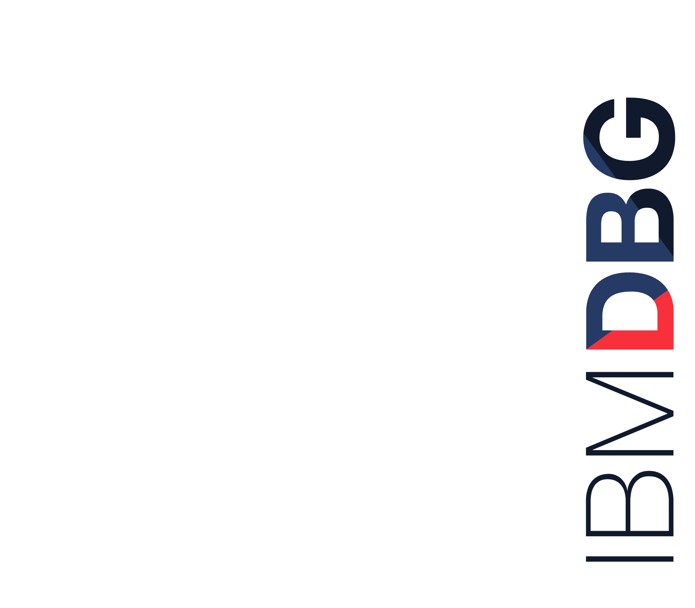

# Build a knowledge base with domain specific documents using Watson Studio

Offering Managers: 

Development: 

Month Day, Year

&nbsp;
&nbsp;
&nbsp;
&nbsp;

## Overview

Building a knowledge base out of domain specific documents in order to query and obtain the desired answer to document-specific questions. This code pattern uses Waston Studio, Watson NLU and Node-Red to provide an end to end solution for a user who wants answers to questions related to a document.

## Architecture Diagram

## IBM Products

* Watson Studio
* Watson NLU

## Related Technologies

* Python, Object Storage, Node-Red

## Key Features

## Rationale

The analysis of the unstructured Data starts with a conventional process to somehow convert it into a knowledge base, which is much easier to perform any analysis on. This semi-structured format can be used to further answer questions based on the document, by querying them. This provides an end-to-end solution to query any unstructured documents for answers.

## Code Pattern Hypothesis

### Opportunity

* This Code Pattern targets developers wishing to leverage Watson NLU capabilities and Watson Studio services

### Operational Efficiency

* Providing capability to give some structure to unstructured documents of any specified domain
* Being able to answer questions based on the document provided

### Advocacy Potential
* Natural Language Processing developers

### Amplification

### Competition

## Concept

### What is the Code Pattern?

This code pattern  demonstrates how unstructured information can be represented as a knowledge base and how it can be queried to answer questions from this document, using Watson Studio and Watson NLU. It runs on python backend which structures the data by building a knowledge graph and uses fuzzy logic techniques to get answers out of the knowledge graph, for the questions posed by a user.

### Who is it for?

Pattern is for those who want to be able to extract useful information from an unstructured content with Watson Studio and Watson NLU as services.

### What will they learn?

## What does it look like?

# Strategy

## What is the strategy?

The management of unstructured data is recognized as one of the major unsolved problems in the information technology (IT) industry, the main reason being that the tools and techniques that have proved so successful transforming structured data into business intelligence and actionable information simply don’t work when it comes to unstructured data. Being able to bring this to a semi-structured format and being able to query it will definitely help addressing the above mentioned problem.

## What is the advocacy potential?

This journey is relevant any developer who wants some automation in the process of extracting information from an unstructured document in any domain. It shows how this can be done by integrating Watson Studio and Watson NLU services.

## What are some target events or meetups?

## How does this impact the city and community Heat Maps?

## What are the key metrics for this Code Pattern?

1. \# Github repo forks, stars, pull requests
2. \# Number of meetups, Conferences, presentations

